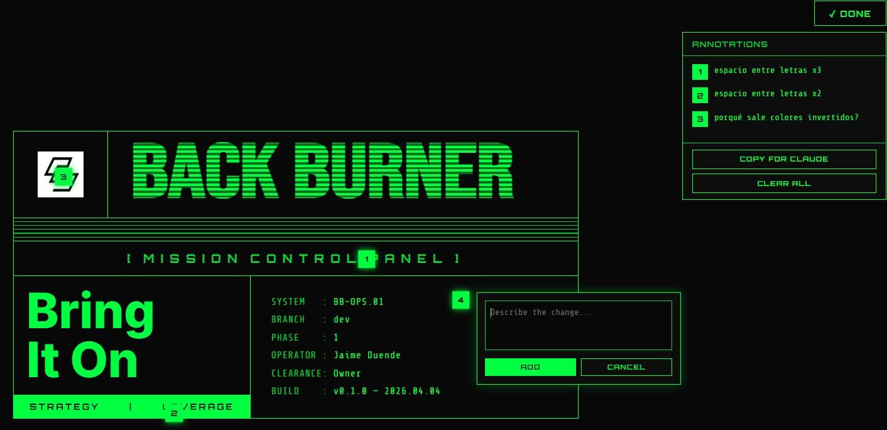

# rock-this-shut

A Claude Code skill that transposes the visual language of a reference image or GIF into a new use case — producing a technical spec and an approved, annotatable visual mock ready for development.

---

## What it does

Most design tools help you generate interfaces from scratch or audit existing ones. **rock-this-shut** does something different: it takes a visual reference you already love — a dashboard, a game HUD, a military radar screen, an old terminal UI — and helps you adapt that exact visual language to a completely new purpose.

The process has two parallel tracks running together:

- **Visual track** — extracts colors, typography, spacing, animations, composition
- **Semantic track** — understands the *meaning* of each component and maps it to your new use case

You don't just get a style clone. You get a reasoned transposition: "this rotating orbital becomes your team cycle, these blinking counters become your KPIs."

---

## In the Wild

Reference image used: **Brass Hands agency card** — military-tactical identity piece, phosphor green on black, CRT scan-line aesthetic.

New use: **Back Burner Mission Control Panel** — internal business operations dashboard for SCI.

The skill decoded the card's components (logo mark, brand title, classification tag, tagline, metadata block, grid), adapted each to the new context, specified the technical implementation, and generated an annotatable HTML mock — all without writing a single line of production code.

---

## Phases

| Phase | What happens |
|-------|-------------|
| **DECODE** | Claude decomposes the reference into named components. You can add, edit, or remove any. Then you have a free conversation about what the reference *is* and *means* as a whole. |
| **ADAPT** | You describe your new use case. Claude maps each component to it — one at a time, with alternatives. Components that don't map cleanly are flagged explicitly. |
| **SPECIFY** | Claude writes the technical spec: colors, typography, animations, layout. Decides which tools/libraries to use, with justification. |
| **MOCK** | Claude generates a self-contained HTML mock with the annotation UI injected. You mark changes directly in the browser and send them back. |
| **ITERATE** | You paste your annotations (`[1] change this`, `[2] fix that`). Claude applies them, regenerates the mock, re-injects the annotation UI clean. Repeat until approved. |

Each phase ends with an explicit gate — Claude never advances without your confirmation.

**Output:** Two files written to your project when you approve the mock:
- `docs/rock-this-shut/rock-this-shut-spec.md` — full visual and technical specification
- `docs/rock-this-shut/rock-this-shut-plan.md` — development plan ready for your dev workflow

The skill does **not** write production code. It hands off to your normal development process.

---

## Annotation System

Every mock generated by rock-this-shut includes a built-in annotation UI:

- Click **✏ ANNOTATE** to enter annotation mode (cursor becomes crosshair)
- Click any element on the mock — a numbered pin appears and an input opens
- Type your change request, press Enter
- When done, click **Copy for Claude** — it copies all annotations in `[n] comment` format
- Paste directly into Claude Code — the next mock version is generated automatically

No external tools, no screenshots, no friction. The annotation UI lives inside the HTML file itself.



---

## Installation

### Requirements
- [Claude Code](https://claude.ai/code) (CLI, desktop app, or IDE extension)

### Install

**macOS / Linux:**
```bash
mkdir -p ~/.claude/skills/rock-this-shut
curl -o ~/.claude/skills/rock-this-shut/SKILL.md \
  https://raw.githubusercontent.com/ElJaimeDuende/rock-this-shut/main/rock-this-shut.md
```

**Windows (PowerShell):**
```powershell
New-Item -ItemType Directory -Force -Path "$env:USERPROFILE\.claude\skills\rock-this-shut"
Invoke-WebRequest `
  -Uri "https://raw.githubusercontent.com/ElJaimeDuende/rock-this-shut/main/rock-this-shut.md" `
  -OutFile "$env:USERPROFILE\.claude\skills\rock-this-shut\SKILL.md"
```

**Manual:**
1. Download `rock-this-shut.md` from this repo
2. Create the folder `~/.claude/skills/rock-this-shut/`
3. Place the file inside it, renamed as `SKILL.md`

---

## Usage

In any Claude Code session, invoke the skill:

```
/rock-this-shut
```

Claude will ask you to share your reference image or GIF. From there, follow the phases.

### Tips

- Works with static images and animated GIFs
- Works in any language — Claude responds in whatever language you write in
- If your reference has an ambiguous meaning, Claude will offer 2-3 interpretations before proceeding
- You control the component list in DECODE — add, edit, or remove anything
- The holistic conversation in DECODE is where the magic happens: the more context you give about the origin (industry, era, purpose), the better the transposition
- The annotation system works best with the HTML mock opened directly in your browser (double-click the file)

---

## Built with

This skill was designed and built using [Claude Code](https://claude.ai/code) with the [Superpowers skills system](https://github.com/anthropics/claude-code).

The workflow used:
- `superpowers:brainstorming` — designed the skill architecture
- `superpowers:writing-plans` — created the implementation plan
- `superpowers:subagent-driven-development` — built the skill task by task with spec compliance review at each step

---

## License

MIT
